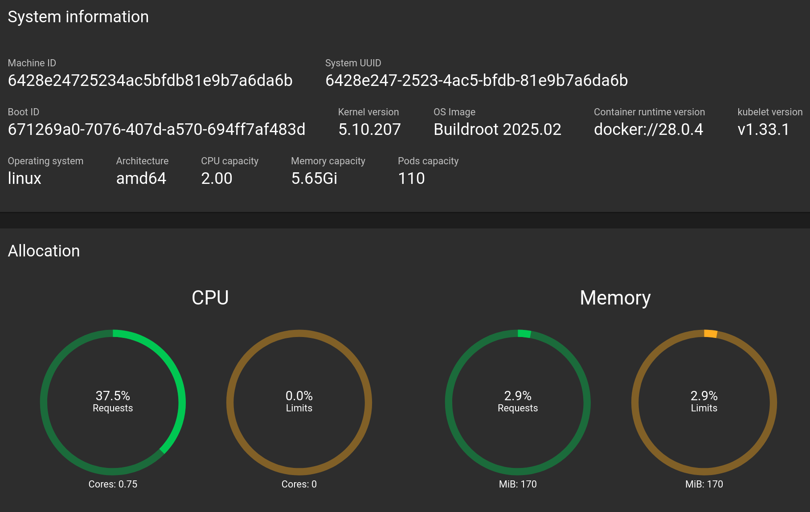

# Lesson 0: Kubernetes Dashboard
The Kubernetes Dashboard is a web-based UI providing cluster information and
deployment status in Kubernetes.  It will give visual feedback for the commands
you'll be running during the workshop and help you understand the state of a
cluster at a glance. While the dashboard may be used to directly manage a
Kubernetes cluster, we will take the more explicit approach to
management with the Kubernetes CLI, `kubectl`.

## Dashboard Access
minikube has built-in support for the Kubernetes Dashboard. First, start a
cluster if you have not already:
```bash
$ minikube start
```
Then, launch the dashboard with
```bash
$ minikube dashboard
```
This should open the web UI in a browser window. Alternatively, run `minikube
dashobard --url` and copy the URL. 

> ⚠️  You will need to leave the terminal process open (or fork the command into
> the background) to maintain access to the dashboard.

## Dashboard Overview
The dashboard is organised into several sections.
We'll focus on the parts immediately relevant for getting started:
Workloads, Cluster Nodes and Namespaces.
In subsequent lessons, we will also introduce ingress, storage volumes
and config maps found under the Service and Config and Storage sections.

### Workloads
Workloads shows the applications running in your cluster, including

- **Deployments**: High-level specifications for running applications
- **Pods**: Provide instances of you  application (the smallest deployable units in Kubernetes)
- **Replica Sets**: Ensure the desired number of pods are running

For now, Workloads will be mostly empty since we haven't deployed any applications.

### Cluster Information
Navigate to `Cluster > Nodes` to view information about your minikube cluster.
Here you'll see a single minikube node, which represents the virtual machine
running your Kubernetes cluster.

Clicking on the node name (minikube) will show detailed information
including CPU and memory allocation, system information, and running pods.
You'll notice several pods already running for essential system services,
such as storage provision and network routing&mdash;plus a pod for the dashboard.


*minikube system information in the dashboard (`Cluster > Nodes > minikube`)*

### Namespaces
The dropdown menu next to the search bar at the top of the dashboard
allows you to filter by **namespace**. Namespaces are a fundamental
Kubernetes concept. They provide a way to organise and isolate resources within
a cluster. 

In this workshop, we will work in the *default* namespace, which is
created automatically. In the real-world, you may want to use
namespaces to divide resources between projects, teams or environments (e.g.,
`dev`, `prod`). You may find it helpful to explore the *kube-system* namespace
 to see what's running behind the scenes


## 💡 Tips
- Keep the dashboard open to see the effect of `kubectl` commands in real-time
- <span style="color: green;">Green</span> typically mean healthy/running,
  <span style="color: green;">yellow</span>  pending/updating, and
   <span style="color: red;">red</span> an  error state
- Click on any resource name to get detailed information and logs

## 📚 Further Reading
- [Official Kubernetes Dashboard
  Documentation](https://kubernetes.io/docs/tasks/access-application-cluster/web-ui-dashboard/)
- Power-users may be interested in the [k9s terminal-based
  UI](https://k9scli.io/a) or the [Lens IDE](https://k8slens.dev/)
